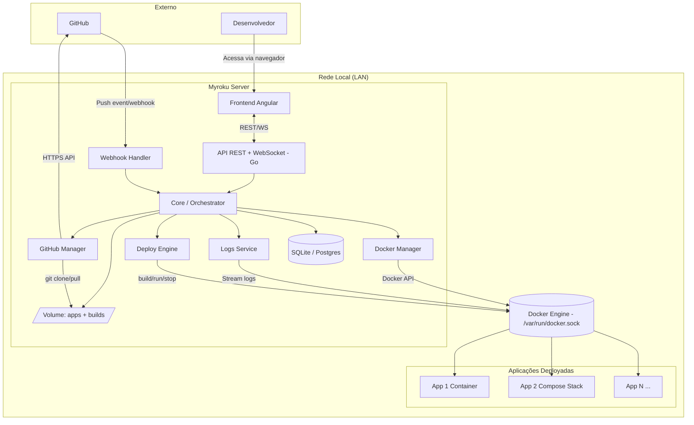
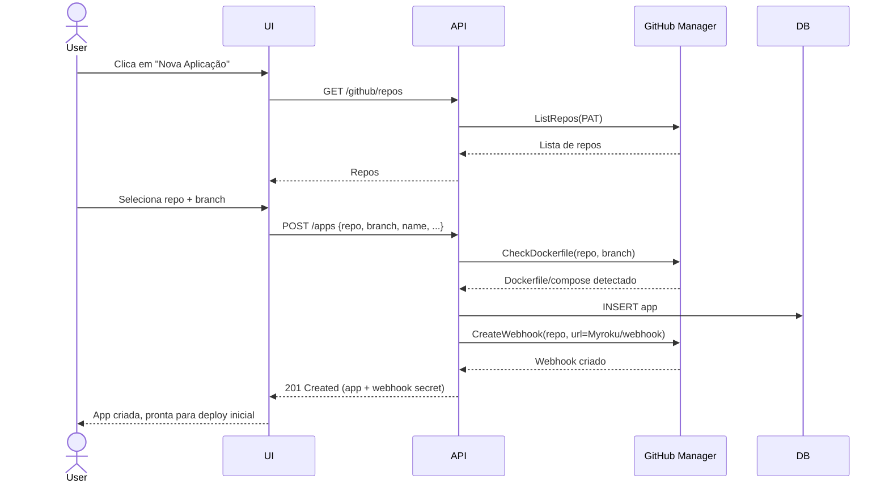
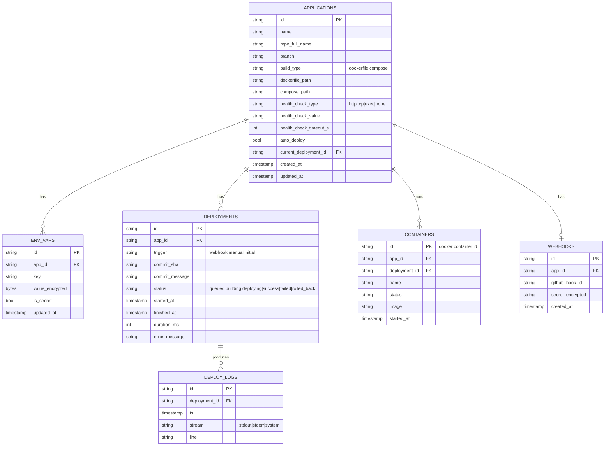

# Myroku — Plano de Ação e Arquitetura

> PaaS self-hosted inspirado no Hiroko, focado em deploy de aplicações Docker / Docker Compose em rede local privada.

---

## 1. Visão Geral

**Myroku** é uma plataforma de deploy contínuo (PaaS) que roda dentro da sua rede local. O objetivo é replicar a experiência do Hiroko/Heroku para projetos containerizados, sem depender de provedores externos nem de GitHub Actions.

### Premissas

- **Rede privada**: acessível somente dentro da LAN, sem exposição externa.
- **Sem autenticação**: não há login — quem está na rede tem acesso total.
- **Único requisito de aplicação**: ter `Dockerfile` e/ou `docker-compose.yml` na raiz (ou caminho configurável).
- **Atualização via webhook**: GitHub envia webhook → Myroku clona → builda → sobe novo container → mata o antigo.
- **Sem GitHub Actions**: todo o pipeline ocorre dentro do Myroku.

### Características principais

- Conexão com GitHub via Personal Access Token (PAT) para listar e clonar repositórios.
- Cadastro de aplicações com seleção de repositório, branch e estratégia de build.
- Gerenciamento de variáveis de ambiente por aplicação (com persistência criptografada em disco).
- Deploy automático por webhook ou manual via UI.
- Visualização de logs em tempo real (stdout/stderr dos containers).
- Listagem de processos rodando dentro dos containers.
- Operações de start/stop/restart/kill em containers.
- Histórico de deploys com possibilidade de rollback.

---

## 2. Arquitetura de Alto Nível



### Componentes resumidos

| Componente | Responsabilidade |
|------------|------------------|
| **Frontend (Angular)** | Interface de usuário — dashboard, formulários, viewer de logs em tempo real. |
| **API REST + WebSocket (Go)** | Expõe endpoints HTTP e canal WebSocket para streams (logs, status). |
| **Core / Orchestrator** | Coordena os módulos, gerencia fila de jobs de deploy, estado global. |
| **Webhook Handler** | Recebe e valida webhooks do GitHub, dispara deploys. |
| **GitHub Manager** | Lista repositórios, clona, autentica via PAT, gerencia webhooks. |
| **Docker Manager** | Abstrai Docker Engine API — containers, imagens, networks, volumes. |
| **Deploy Engine** | Pipeline de build → start novo → health check → stop antigo. |
| **Logs Service** | Stream de logs e listagem de processos via `docker logs` / `docker top`. |
| **Persistência (SQLite/Postgres)** | Apps cadastradas, env vars, deploys, configurações. |
| **Filesystem volume** | Repositórios clonados, builds em andamento, artefatos. |

---

## 3. Módulos do Sistema

A divisão é orientada para o backend em Go (Hexagonal / Clean Architecture).

### 3.1 Módulos do Backend

```
backend/
├── cmd/
│   └── Myroku/                  # Entry point
├── internal/
│   ├── core/                  # Domain entities + use cases
│   │   ├── app/               # Aggregate "Application"
│   │   ├── deploy/            # Aggregate "Deployment"
│   │   ├── envvar/            # Variáveis de ambiente
│   │   └── webhook/           # Eventos de webhook
│   ├── adapters/
│   │   ├── http/              # REST handlers + WebSocket
│   │   ├── docker/            # Docker Engine client
│   │   ├── github/            # GitHub API client
│   │   ├── git/               # git CLI wrapper (clone, fetch)
│   │   ├── persistence/       # Repositórios SQLite
│   │   └── secrets/           # Cifragem de env vars (AES-GCM)
│   ├── services/
│   │   ├── deployer/          # Deploy Engine
│   │   ├── logger/            # Logs streaming
│   │   ├── orchestrator/      # Job queue + workers
│   │   └── proxy/             # (opcional) atualização de reverse proxy
│   └── platform/
│       ├── config/            # Config via env/yaml
│       ├── logging/           # Logger estruturado (zap/zerolog)
│       └── id/                # Geração de IDs (ulid/uuid)
└── migrations/                # SQL migrations
```

### 3.2 Módulos do Frontend (Angular)

```
frontend/
└── src/app/
    ├── core/                  # Services singletons (api, ws, state)
    ├── shared/                # Componentes/diretivas reutilizáveis
    ├── features/
    │   ├── dashboard/         # Lista de apps
    │   ├── app-detail/        # Detalhe + abas (overview, deploys, env, logs, settings)
    │   ├── new-app/           # Wizard de criação
    │   ├── deploys/           # Histórico e detalhes de deploys
    │   ├── logs/              # Viewer de logs em tempo real
    │   ├── containers/        # Visão geral de todos os containers
    │   └── settings/          # GitHub PAT, config geral
    └── layout/                # Sidebar, topbar
```

### 3.3 Lista detalhada de módulos funcionais

1. **Application Registry** — CRUD de aplicações cadastradas.
2. **GitHub Integration** — autenticação por PAT, listagem de repos, criação automática de webhook no repositório selecionado.
3. **Webhook Receiver** — endpoint público (na LAN) que valida HMAC e enfileira deploy.
4. **Deployment Engine** — fluxo build → run → switch → cleanup.
5. **Container Manager** — start/stop/restart/kill, listar processos (`docker top`), inspecionar.
6. **Image Manager** — build, prune, listar imagens órfãs.
7. **Compose Manager** — wrapper sobre `docker compose` para stacks multi-container.
8. **Environment Variables Manager** — CRUD de env vars por app, com cifragem em repouso.
9. **Logs Service** — stream em tempo real (WebSocket) + busca em logs históricos.
10. **Deploy History** — auditoria de cada deploy (commit, status, duração, logs do build).
11. **Health Check Service** — verificação de saúde após subir novo container.
12. **Job Queue / Worker Pool** — fila in-memory (ou Redis futuro) para deploys concorrentes.
13. **Reverse Proxy Integration** *(fase 2)* — Traefik ou Caddy para roteamento por hostname/porta.
14. **Notification Service** *(fase 2)* — webhook outbound, e-mail ou Discord avisando deploy.
15. **Backup / Restore** *(fase 2)* — exportar/importar configuração das apps.

---

## 4. Fluxos Principais

### 4.1 Fluxo de Cadastro de Aplicação



### 4.2 Fluxo de Deploy via Webhook (CORE)

```mermaid
flowchart TD
    A[GitHub Push] --> B[Webhook recebido em POST /webhooks/github]
    B --> C{Validar HMAC}
    C -->|Inválido| C1[401 Unauthorized<br/>+ log de tentativa]
    C -->|Válido| D[Identificar app pelo repo + branch]
    D --> E{App existe e<br/>auto-deploy ativo?}
    E -->|Não| E1[200 OK ignorado]
    E -->|Sim| F[Criar registro Deploy status=queued]
    F --> G[Enfileirar job no Worker Pool]
    G --> H[Worker pega job]
    H --> I[git clone/pull em apps/&#123;app&#125;/build-&#123;deployId&#125;]
    I --> J{Dockerfile ou<br/>docker-compose?}
    J -->|Dockerfile| K1[docker build -t app:deploy-id .]
    J -->|Compose| K2[docker compose build]
    K1 --> L[Injetar env vars]
    K2 --> L
    L --> M[Subir novo container/stack<br/>com nome temporário<br/>app-new-&#123;deployId&#125;]
    M --> N[Health check<br/>HTTP/TCP/exec]
    N --> O{Saudável?}
    O -->|Não| P1[Remover novo container<br/>Marcar deploy=failed<br/>Manter antigo no ar]
    O -->|Sim| Q[Switch: parar container antigo]
    Q --> R[Renomear novo para nome final]
    R --> S[Remover container antigo]
    S --> T[Prune imagens antigas dangling]
    T --> U[Deploy=success<br/>Salvar logs do build]
    P1 --> V[Notificar UI via WebSocket]
    U --> V
```



#### Detalhes do passo de "switch"

A estratégia de cutover depende do tipo de app:

- **App standalone (1 container, sem porta exposta no host)**: simplesmente para o antigo e renomeia o novo. Janela de indisponibilidade próxima de zero (apenas troca de nome).
- **App standalone com porta no host** (ex.: `-p 8080:80`): inevitavelmente há colisão. Estratégias:
  - **Cutover simples (default)**: para o antigo → sobe o novo. Downtime de poucos segundos.
  - **Cutover com reverse proxy** (fase 2): novo container sobe em porta interna aleatória, Traefik atualiza upstream, antigo é drenado. Zero downtime.
- **Compose stack**: usa `docker compose up -d --build` que já faz recreate inteligente, e depois `docker compose ps` valida.

### 4.3 Fluxo de Deploy Manual

Idêntico ao 4.2, mas disparado por `POST /apps/{id}/deploy` com `{ branch?, ref? }`. A diferença é que pula a validação de HMAC e o registro tem `trigger=manual`.

### 4.4 Fluxo de Visualização de Logs

```mermaid
sequenceDiagram
    actor User
    participant UI
    participant API
    participant WS as WebSocket
    participant DM as Docker Manager
    participant Docker

    User->>UI: Abre aba "Logs" da app
    UI->>WS: Conecta em /ws/apps/&#123;id&#125;/logs
    WS->>API: Upgrade HTTP -> WS
    API->>DM: StreamLogs(containerId, follow=true)
    DM->>Docker: GET /containers/&#123;id&#125;/logs?follow=1&stdout=1&stderr=1
    Docker-->>DM: Stream chunked
    loop Enquanto conectado
        DM->>WS: chunk de log
        WS->>UI: mensagem JSON &#123;ts, stream, line&#125;
        UI->>User: Append no viewer
    end
    User->>UI: Fecha aba
    UI->>WS: Disconnect
    WS->>DM: Cancel stream
```



### 4.5 Fluxo de Gerenciamento de Containers

```mermaid
flowchart LR
    A[Tela Containers] --> B[GET /containers]
    B --> C[Lista todos containers gerenciados pelo Myroku]
    C --> D{Ação do usuário}
    D -->|Restart| E[POST /containers/&#123;id&#125;/restart]
    D -->|Stop| F[POST /containers/&#123;id&#125;/stop]
    D -->|Start| G[POST /containers/&#123;id&#125;/start]
    D -->|Ver processos| H[GET /containers/&#123;id&#125;/top]
    D -->|Ver logs| I[Abre /apps/&#123;id&#125;/logs]
    E --> J[Docker API]
    F --> J
    G --> J
    H --> J
    J --> K[Atualiza estado e retorna]
    K --> A
```



### 4.6 Fluxo de Edição de Variáveis de Ambiente

```mermaid
sequenceDiagram
    actor User
    participant UI
    participant API
    participant Crypto
    participant DB

    User->>UI: Edita env vars (chave/valor)
    UI->>API: PUT /apps/&#123;id&#125;/env (lista)
    API->>Crypto: Encrypt(valor) AES-GCM com chave master
    Crypto-->>API: ciphertext
    API->>DB: UPSERT env_vars
    API-->>UI: 200 OK
    UI->>User: "Variáveis salvas. Aplicar requer redeploy."
    User->>UI: Clica em "Redeploy"
    UI->>API: POST /apps/&#123;id&#125;/deploy
```



> **Importante**: env vars só têm efeito após um redeploy. A UI deve sinalizar isso claramente.

---

## 5. Modelo de Dados



### Notas sobre persistência

- **SQLite** é suficiente para começar. Uma única database file em `/var/lib/Myroku/Myroku.db`.
- **Migrations** com `golang-migrate` ou `goose`.
- **Logs de deploy** podem crescer rápido — considerar rotação/truncamento (manter últimos 30 deploys completos por app, depois só metadados).
- **Logs de container em tempo real** **não** são persistidos no SQLite — vêm diretamente do Docker. Apenas um buffer in-memory para reconexões rápidas.

---

## 6. API REST — Endpoints

### Aplicações

| Método | Rota | Descrição |
|--------|------|-----------|
| GET | `/api/apps` | Lista todas as aplicações |
| POST | `/api/apps` | Cria nova aplicação |
| GET | `/api/apps/:id` | Detalhe da aplicação |
| PATCH | `/api/apps/:id` | Atualiza configuração |
| DELETE | `/api/apps/:id` | Remove app + containers + webhook GitHub |

### Variáveis de Ambiente

| Método | Rota | Descrição |
|--------|------|-----------|
| GET | `/api/apps/:id/env` | Lista env vars (valores mascarados) |
| PUT | `/api/apps/:id/env` | Substitui o conjunto inteiro |
| PATCH | `/api/apps/:id/env/:key` | Atualiza/cria uma única var |
| DELETE | `/api/apps/:id/env/:key` | Remove var |

### Deploys

| Método | Rota | Descrição |
|--------|------|-----------|
| GET | `/api/apps/:id/deployments` | Histórico paginado |
| POST | `/api/apps/:id/deploy` | Deploy manual |
| GET | `/api/deployments/:id` | Detalhe + logs do build |
| POST | `/api/deployments/:id/rollback` | Rollback para um deploy passado |

### Containers

| Método | Rota | Descrição |
|--------|------|-----------|
| GET | `/api/containers` | Todos containers gerenciados |
| GET | `/api/containers/:id` | Inspect |
| POST | `/api/containers/:id/start` | Start |
| POST | `/api/containers/:id/stop` | Stop |
| POST | `/api/containers/:id/restart` | Restart |
| POST | `/api/containers/:id/kill` | Kill (SIGKILL) |
| GET | `/api/containers/:id/top` | Lista de processos |
| GET | `/api/containers/:id/stats` | CPU/Mem em tempo real |

### GitHub

| Método | Rota | Descrição |
|--------|------|-----------|
| GET | `/api/github/repos` | Lista repos do PAT |
| GET | `/api/github/repos/:owner/:repo/branches` | Branches |
| GET | `/api/github/repos/:owner/:repo/check` | Detecta Dockerfile/compose |

### Webhooks

| Método | Rota | Descrição |
|--------|------|-----------|
| POST | `/webhooks/github` | Recebe push events do GitHub |

### WebSocket

| Endpoint | Descrição |
|----------|-----------|
| `/ws/apps/:id/logs` | Stream de logs do container atual |
| `/ws/deployments/:id/logs` | Stream de logs do build em andamento |
| `/ws/events` | Eventos globais (status de deploys, mudanças de container) |

### Configuração

| Método | Rota | Descrição |
|--------|------|-----------|
| GET | `/api/settings` | Configurações gerais |
| PUT | `/api/settings/github-token` | Define/atualiza PAT |
| GET | `/api/settings/health` | Health check do próprio Myroku |

---

## 7. Estrutura de Telas (Wireframes)

> Sem preocupação com design — apenas estrutura e hierarquia de informação.

### 7.1 Layout Global

```
┌─────────────────────────────────────────────────────────────┐
│ [Myroku logo]   Apps   Containers   Settings        [status●] │  ← Topbar
├──────────┬──────────────────────────────────────────────────┤
│          │                                                  │
│ Sidebar  │            Conteúdo da página                    │
│  ▸ Apps  │                                                  │
│  ▸ Cont. │                                                  │
│  ▸ Set.  │                                                  │
│          │                                                  │
└──────────┴──────────────────────────────────────────────────┘
```

### 7.2 Tela: Dashboard (Lista de Apps)

```
┌──────────────────────────────────────────────────────────────┐
│  Aplicações                              [+ Nova Aplicação]  │
│  [busca...] [filtro: status v]                               │
├──────────────────────────────────────────────────────────────┤
│  ● my-api          repo/my-api    main      ↑ 2h    [→]      │
│    running         último deploy: success                    │
├──────────────────────────────────────────────────────────────┤
│  ● dashboard       repo/dash      main      ↑ 1d    [→]      │
│    running         último deploy: success                    │
├──────────────────────────────────────────────────────────────┤
│  ✕ worker          repo/worker    main      ↓ 5m    [→]      │
│    stopped         último deploy: failed                     │
└──────────────────────────────────────────────────────────────┘
```

### 7.3 Tela: Detalhe da Aplicação (com abas)

```
┌──────────────────────────────────────────────────────────────┐
│  ← Apps  /  my-api                         ● running         │
│  repo/my-api • main • commit a1b2c3d                         │
│  [Deploy now] [Restart] [Stop] [Settings]                    │
├──────────────────────────────────────────────────────────────┤
│ [Overview] [Deploys] [Logs] [Env Vars] [Processes] [Settings]│
├──────────────────────────────────────────────────────────────┤
│                                                              │
│   Conteúdo da aba selecionada                                │
│                                                              │
└──────────────────────────────────────────────────────────────┘
```

#### Aba Overview

```
Status: running
Container: my-api-prod  (id: 7a3f...)
Imagem: my-api:deploy-42
Iniciado: 2 horas atrás
Último deploy: success (32s) — commit a1b2c3d "fix: ..."
Health check: HTTP GET /health → 200 (a cada 30s)

CPU: ▆▆▆▂▁▁▂▃▆▇  12%        Mem: 134MB / 512MB
```

#### Aba Deploys

```
┌────────────────────────────────────────────────────────────┐
│ #42  ✓ success    a1b2c3d  fix: ...     2h    32s   [view] │
│ #41  ✓ success    9f8e7d6  feat: ...    1d    28s   [view] │
│ #40  ✕ failed     5c4b3a2  refactor:    2d    18s   [view] │
│ #39  ✓ success    1a2b3c4  chore:       3d    30s   [view] │
└────────────────────────────────────────────────────────────┘
```

#### Aba Logs

```
┌──────────────────────────────────────────────────────────────┐
│ [● live] [pause] [clear] [download]  filtro: [____] [stderr□]│
├──────────────────────────────────────────────────────────────┤
│ 14:32:01.234  stdout  Server listening on :8080              │
│ 14:32:05.871  stdout  GET /api/users 200 12ms                │
│ 14:32:06.012  stderr  warn: deprecated config key            │
│ 14:32:10.998  stdout  GET /api/health 200 1ms                │
│ ...                                                          │
└──────────────────────────────────────────────────────────────┘
```

#### Aba Env Vars

```
┌──────────────────────────────────────────────────────────────┐
│  Variáveis de Ambiente            ⚠ alterações exigem deploy │
├──────────────────────────────────────────────────────────────┤
│  KEY                VALUE                          [secret]  │
│  DB_HOST            postgres.local                  [ ]   ✕  │
│  DB_PASSWORD        ●●●●●●●●●●         [reveal]     [✓]   ✕  │
│  PORT               8080                            [ ]   ✕  │
│  [+ Adicionar]                                               │
│                                       [Salvar] [Salvar+Deploy]│
└──────────────────────────────────────────────────────────────┘
```

#### Aba Processes

```
┌──────────────────────────────────────────────────────────────┐
│ Processos rodando no container                               │
├──────────────────────────────────────────────────────────────┤
│ PID    USER   CPU   MEM   COMMAND                            │
│ 1      root   0.1   12M   /app/server                        │
│ 14     root   0.0    2M   sh -c tail -f log                  │
│ 22     root   0.5    8M   /app/worker                        │
└──────────────────────────────────────────────────────────────┘
```

#### Aba Settings

```
Nome:                [my-api______________]
Repositório:         repo/my-api  (não editável)
Branch:              [main______________]
Build type:          (•) Dockerfile  ( ) docker-compose
Dockerfile path:     [./Dockerfile_______]
Auto deploy:         [✓] ao receber push em main
Health check:        Tipo [HTTP v]  Path [/health____]
                     Timeout [30s]

Webhook URL:         http://Myroku.local/webhooks/github
Webhook secret:      ●●●●●●●●  [regenerate]

[Salvar]                                              [✕ Excluir app]
```

### 7.4 Tela: Nova Aplicação (Wizard)

```
Passo 1 — Selecionar repositório
  [busca de repos...]
  ○ repo/my-api          main, develop
  ○ repo/dashboard       main
  ○ repo/worker          main, staging
  [Próximo]

Passo 2 — Configurar build
  Branch:         [main v]
  ✓ Dockerfile detectado em ./Dockerfile
  ✓ docker-compose.yml também detectado
  Usar:           (•) Dockerfile  ( ) Compose
  [Voltar] [Próximo]

Passo 3 — Variáveis de ambiente
  [+ Adicionar variável]
  [Voltar] [Próximo]

Passo 4 — Confirmar
  Resumo da configuração
  [Voltar] [Criar e fazer primeiro deploy]
```

### 7.5 Tela: Containers (visão global)

```
┌──────────────────────────────────────────────────────────────┐
│ Containers          [filtro: app v] [status v]   total: 7    │
├──────────────────────────────────────────────────────────────┤
│ ● my-api-prod        my-api      running   2h     ⋮          │
│ ● postgres-Myroku      (sistema)   running   5d     ⋮          │
│ ● dashboard-prod     dashboard   running   1d     ⋮          │
│ ✕ worker-prod        worker      stopped   5m     ⋮          │
└──────────────────────────────────────────────────────────────┘
   menu ⋮ : Restart | Stop | Kill | Logs | Inspect
```

### 7.6 Tela: Settings

```
GitHub
  Personal Access Token: [●●●●●●●●●●●● ] [test connection]
  Status: ✓ conectado como @user

Servidor
  URL pública (LAN):  http://Myroku.local
  Diretório de apps:  /var/lib/Myroku/apps
  Diretório de logs:  /var/lib/Myroku/logs

Sistema
  Versão:    0.1.0
  Uptime:    3d 14h
  Docker:    24.0.7
```

---

## 8. Stack Técnica Recomendada

### Backend (Go)

| Categoria | Biblioteca | Motivo |
|-----------|-----------|--------|
| HTTP router | `chi` ou `gin` | Leves, idiomáticos |
| WebSocket | `nhooyr.io/websocket` ou `gorilla/websocket` | Streaming de logs |
| Docker | `github.com/docker/docker/client` | Cliente oficial |
| GitHub | `github.com/google/go-github/v60` | Cliente oficial |
| Git CLI | `os/exec` envolvendo `git` | Mais simples que go-git para clone shallow |
| DB | `database/sql` + `mattn/go-sqlite3` ou `modernc.org/sqlite` (puro Go) | Sem dependências nativas |
| Migrations | `golang-migrate` ou `pressly/goose` | Padrão da indústria |
| Logger | `rs/zerolog` ou `uber-go/zap` | Estruturado e rápido |
| Config | `spf13/viper` ou apenas `env` | Simplicidade |
| Crypto | `crypto/aes` + `crypto/cipher` (GCM) stdlib | Suficiente |
| IDs | `oklog/ulid` | Ordenáveis no tempo |

### Frontend (Angular)

| Categoria | Biblioteca |
|-----------|-----------|
| Estado | NgRx (overkill?) ou apenas RxJS BehaviorSubjects + Signals |
| HTTP | HttpClient nativo |
| WebSocket | `rxjs/webSocket` |
| UI | Tailwind CSS (utilitário, sem opinião visual) — design depois |
| Forms | Reactive Forms |
| Roteamento | Router nativo + lazy loading por feature |

### Infraestrutura

- Myroku roda **em container** com `docker.sock` montado (ou em host com binário direto).
- **Volume persistente** para `/var/lib/Myroku` (DB + apps clonadas).
- **Reverse proxy** opcional (Traefik/Caddy) — fase 2.

---

## 9. Estrutura de Diretórios em Disco (Runtime)

```
/var/lib/Myroku/
├── Myroku.db                          # SQLite
├── master.key                       # chave AES de cifragem (chmod 600)
├── apps/
│   └── 01HABCDE.../                 # ID da aplicação
│       ├── current -> build-42/     # symlink para build atual
│       ├── build-41/                # build anterior (mantido para rollback)
│       └── build-42/                # último build, working tree git
│           ├── .git/
│           ├── Dockerfile
│           └── ...
├── logs/
│   └── 01HABCDE.../
│       └── deploy-42.log            # log textual do build
└── tmp/                             # downloads temporários
```

---

## 10. Roadmap / Fases de Implementação

> A prioridade absoluta é o **backend** (servidor Myroku). UI mínima na Fase 1, robustecida nas seguintes.

### Fase 0 — Fundação (1-2 semanas)
- [ ] Setup do monorepo (Go + Angular já existentes do seu projeto base)
- [ ] Estrutura de pastas backend
- [ ] CI local (lint + test)
- [ ] Migrations + entidades core (`Application`, `Deployment`, `EnvVar`)
- [ ] Cliente Docker básico (listar/inspecionar containers)
- [ ] Health endpoint do próprio Myroku
- [ ] Configuração via env vars

### Fase 1 — MVP do Servidor (3-4 semanas)
**Objetivo: deploy funcional ponta a ponta via API.**
- [ ] GitHub Manager — autenticar com PAT, listar repos, listar branches
- [ ] Detecção de Dockerfile/compose em uma ref específica
- [ ] CRUD de Apps via API
- [ ] CRUD de Env Vars com cifragem
- [ ] Webhook Receiver — endpoint, validação HMAC, fila in-memory
- [ ] Deploy Engine v1 (apenas Dockerfile, sem compose):
  - [ ] git clone shallow
  - [ ] docker build
  - [ ] docker run com env injetadas
  - [ ] cutover simples (stop antigo, start novo)
- [ ] Persistência de histórico de deploys e logs do build
- [ ] Endpoints REST de containers (start/stop/restart/kill/top)
- [ ] WebSocket de logs de container
- [ ] CLI mínimo / curl-friendly para testar tudo

### Fase 2 — UI mínima (2-3 semanas)
**Objetivo: substituir o curl pelo Angular.**
- [ ] Layout global (sidebar + topbar)
- [ ] Dashboard com lista de apps
- [ ] Wizard de criação de app
- [ ] Detalhe de app — abas Overview, Deploys, Env Vars
- [ ] Logs viewer em tempo real
- [ ] Tela de containers
- [ ] Tela de settings

### Fase 3 — Compose e Robustez (2-3 semanas)
- [ ] Suporte a docker-compose (`docker compose up -d --build`)
- [ ] Health check configurável (HTTP, TCP, exec)
- [ ] Rollback explícito para deploy anterior
- [ ] Limpeza automática de imagens dangling
- [ ] Reconexão automática do WebSocket
- [ ] Limites de log (rotação)
- [ ] Tratamento de race conditions (deploy concorrente)

### Fase 4 — Conforto (sob demanda)
- [ ] Reverse proxy integrado (Traefik) com roteamento por hostname
- [ ] Estatísticas de CPU/mem por container (ao vivo)
- [ ] Notificações (Discord, e-mail, webhook outbound)
- [ ] Backup/export da configuração
- [ ] Multi-environment (staging/prod por app)
- [ ] Visual / design real (substituir Tailwind cru por sistema de design)

---

## 11. Pontos de Atenção e Decisões de Design

### 11.1 Onde o Myroku roda?

Duas opções:

**(A) Myroku no host, sem container**
- Mais simples para dar `git clone` e acessar o `docker.sock`.
- Requer Go instalado no host ou binário pré-compilado.

**(B) Myroku em container com docker.sock montado**
- Recomendado. Portátil, atualizações simples (nova imagem).
- Volume `/var/run/docker.sock:/var/run/docker.sock`.
- Volume `/var/lib/Myroku:/var/lib/Myroku`.
- ⚠ Acesso ao socket é equivalente a root no host — mas você está em rede privada.

> **Sugestão**: começar com (A) durante o desenvolvimento, migrar para (B) no primeiro release.

### 11.2 Estratégia de cutover

A escolha entre cutover simples e zero-downtime via reverse proxy define quanta complexidade entra agora.

**Decisão recomendada**: começar com cutover simples (Fase 1), promover para Traefik na Fase 4 quando houver necessidade real.

### 11.3 Webhooks e rede privada

Para o GitHub conseguir disparar webhooks, o Myroku precisa ter URL acessível pelo GitHub. Como você disse que ele **não** é acessível de fora, há duas opções:

1. **GitHub Webhook tradicional**: requer que a URL do Myroku seja publicada (pode ser via DDNS + abertura de uma única porta com IP allowlist do GitHub). Quebra a premissa de "rede privada".
2. **Polling**: Myroku consulta GitHub a cada N segundos verificando o último commit do branch monitorado. Sem necessidade de exposição. Latência = intervalo do polling.
3. **GitHub App + tunnel reverso** (cloudflared, tailscale funnel): expõe só o endpoint de webhook através de um túnel autenticado, sem abrir porta no roteador.

> **Decisão a tomar**: este é um ponto crítico que muda a arquitetura. Recomendação inicial: implementar **(2) polling** como fallback e **(1) webhook direto** como caminho preferencial quando o Myroku estiver atrás de um túnel (Tailscale, Cloudflare Tunnel, ngrok). O fluxo de deploy é o mesmo nos dois — só muda o gatilho.

### 11.4 Concurrent deploys

Dois pushes em sequência podem disparar dois deploys simultâneos da mesma app — o que pode dar ruim. Solução:

- Fila por app (mutex). Deploys da mesma app são serializados.
- Deploys de apps diferentes rodam em paralelo (até `N` workers).

### 11.5 Falhas em runtime

- Se um container morrer fora de um deploy (crash), Myroku detecta via `events` do Docker e atualiza o status na UI.
- Política de restart: deixar a cargo do Compose/Docker (`restart: unless-stopped`), Myroku apenas observa.

### 11.6 Segurança apesar de "não ter auth"

Mesmo em rede privada, valem as práticas:

- Cifrar env vars em disco (chave master fora do banco).
- Validar HMAC do webhook (alguém na LAN também pode disparar).
- Rate limit no endpoint de webhook.
- Logs estruturados de qualquer ação destrutiva (delete app, kill container).
- Tornar fácil ligar autenticação no futuro (deixar o middleware preparado, mesmo que vazio).

---

## 12. Resumo Executivo (TL;DR)

1. **Comece pelo backend Go puro** com Docker SDK e GitHub client. Sem UI, sem nada bonito.
2. **Modele as 4 entidades**: `Application`, `Deployment`, `EnvVar`, `Container` (este último é só projeção do Docker).
3. **O coração é o Deploy Engine**: `clone → build → run → health check → switch → cleanup`. Faça funcionar para Dockerfile primeiro, Compose depois.
4. **Webhook é o gatilho preferencial**, mas **decida cedo** como o GitHub vai alcançar o Myroku (túnel? polling? abertura de porta?). Polling é o plano B sempre disponível.
5. **Logs em tempo real via WebSocket** vindos direto do `docker logs` — não persista a torrente, só as últimas linhas em buffer.
6. **UI Angular vem na Fase 2**, e **design vem por último** — Tailwind cru resolve a Fase 2.
7. **Rode o próprio Myroku em container** com `docker.sock` montado assim que estabilizar — mais fácil de atualizar e isolar.
8. **Mesmo sem login, prepare o middleware de auth** — é trivial ligar depois e te protege se algum dia o Myroku escapar da LAN.

---

*Documento vivo — atualize conforme decisões forem tomadas.*